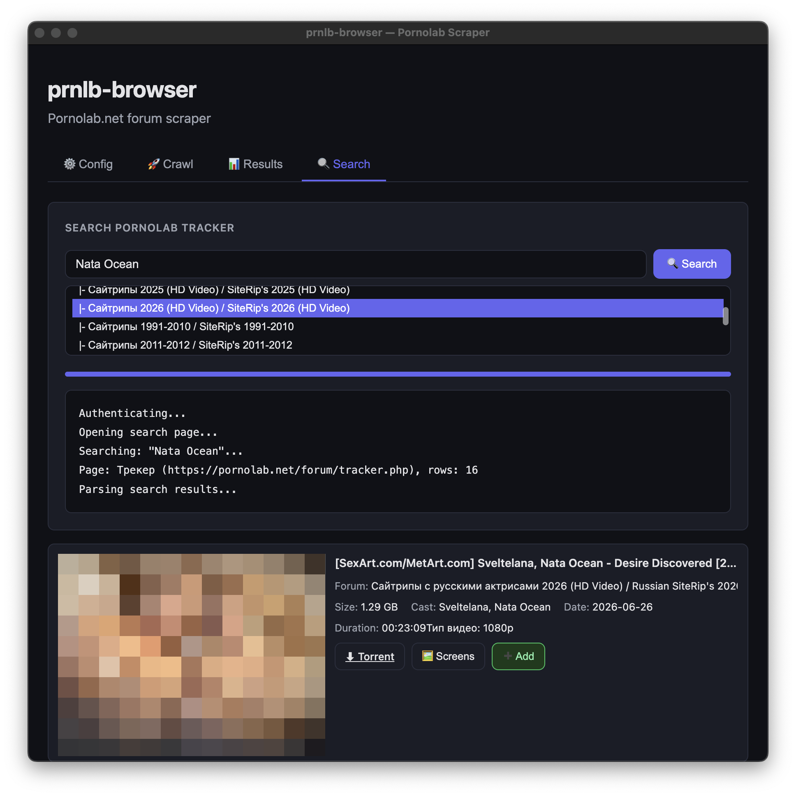
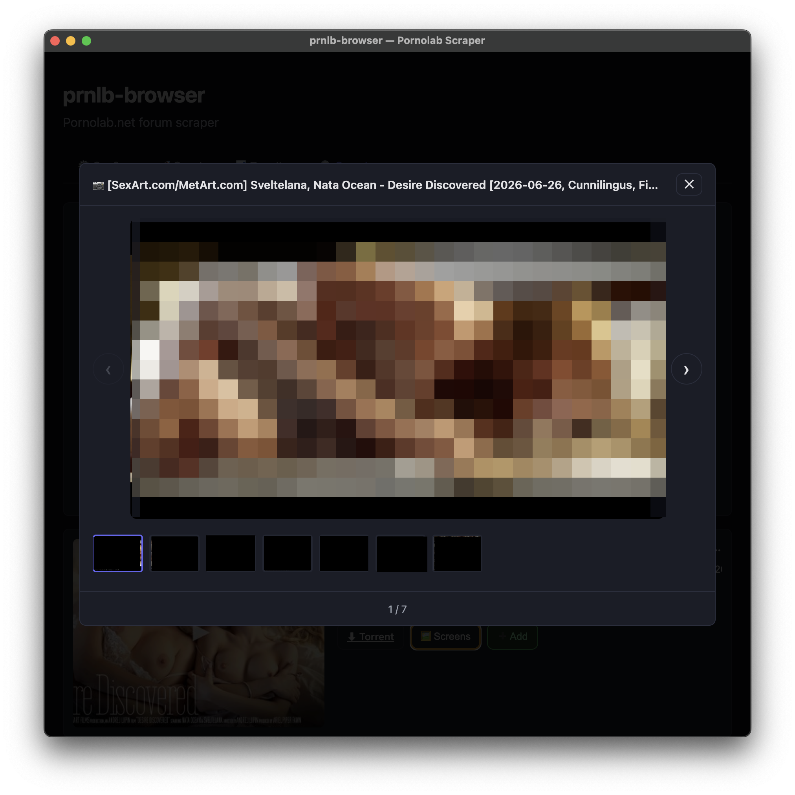
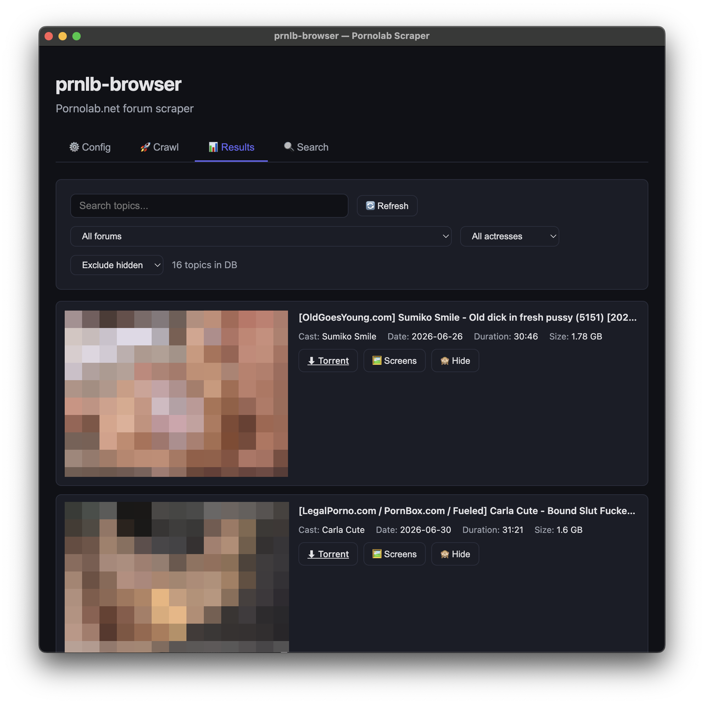
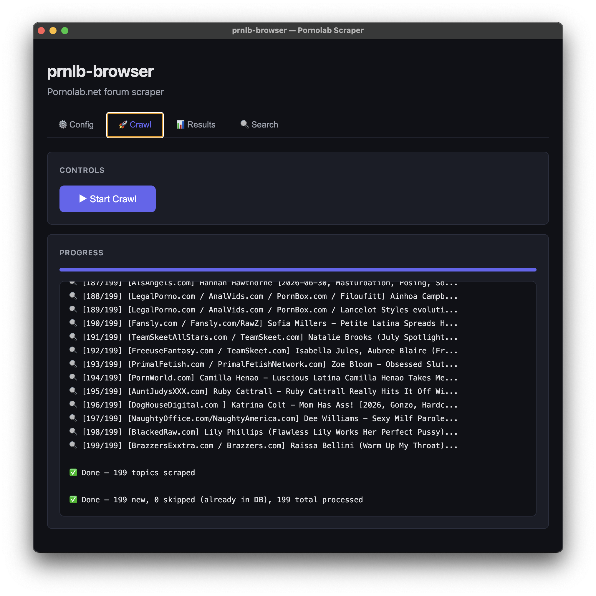
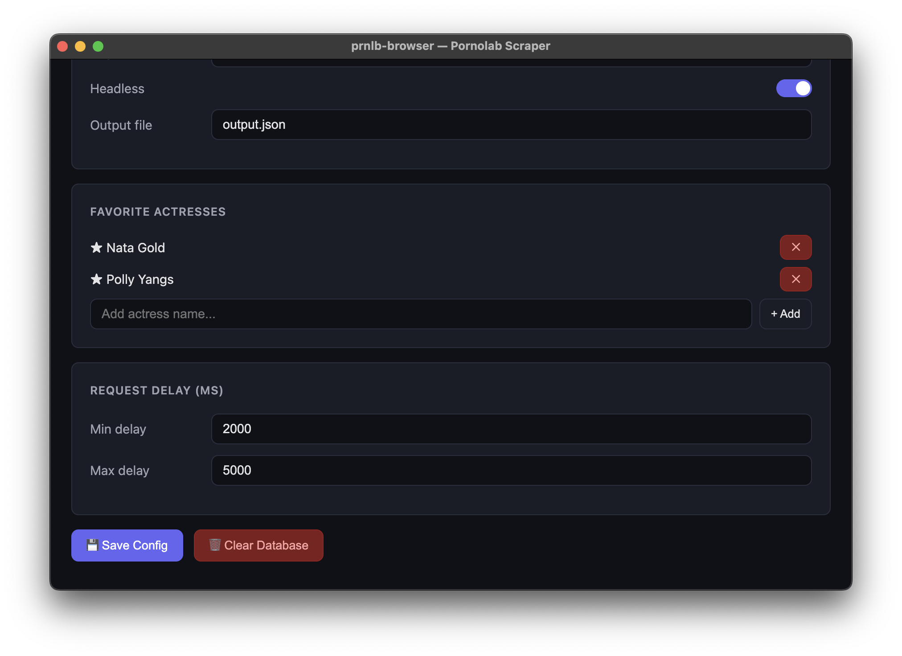
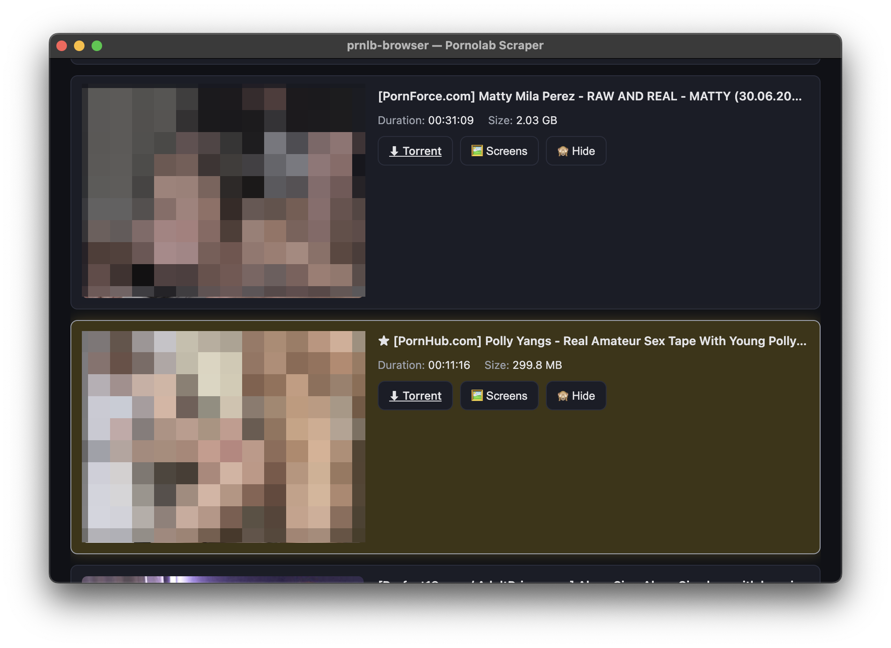
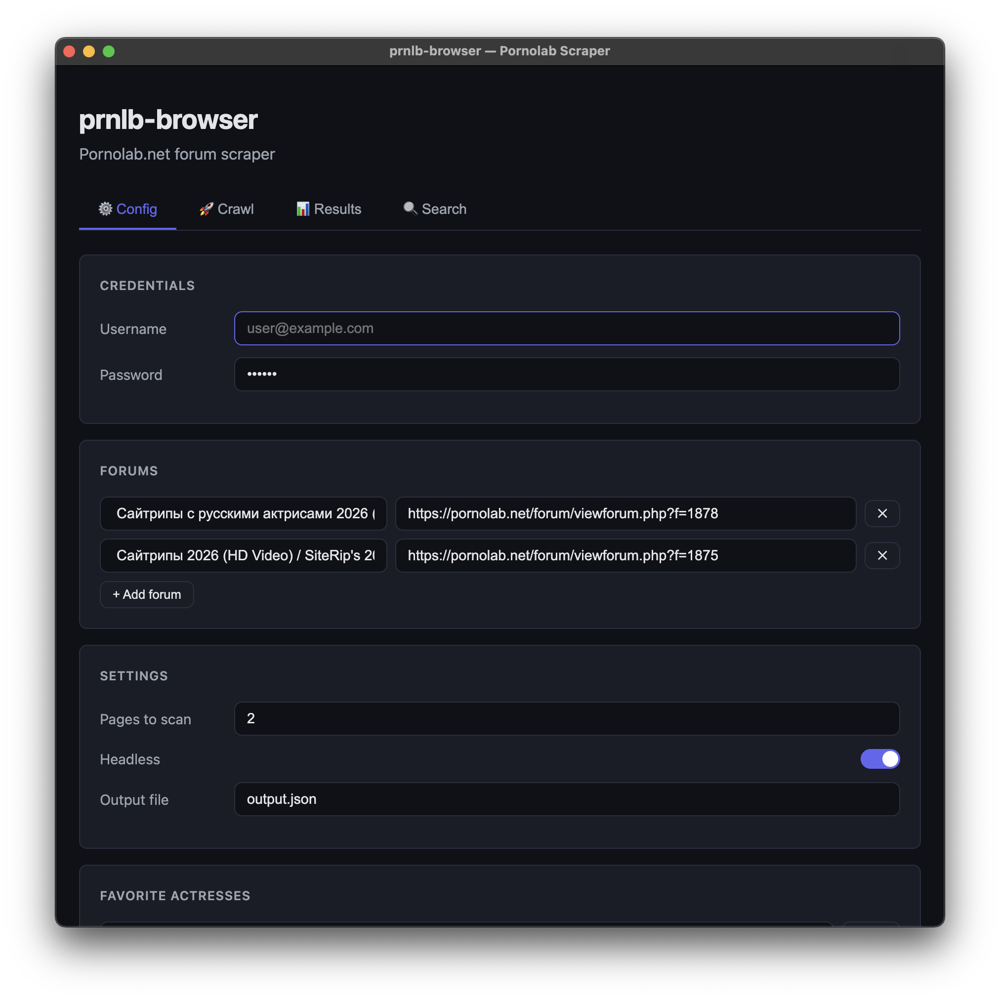

# prnlb-browser

> **Your smart browser toolbox for pornolab.net** — crawl, search, and organize forum topics with ease.

---

## 📸 At a Glance

<p float="left">
  
  
</p>
<p float="left">
  
    
</p>
<p float="left">
  
  
</p>
<p float="left">
  
</p>

---

## ✨ Features

- **🔍 Smart Crawler** — Automatically browse forums, collect topics, and extract rich metadata (title, cast, duration, file size, torrent links, and more)
- **🔎 Full‑Text Search** — Quickly find topics across your entire database
- **📂 Results Browser** — Browse everything with images, metadata, and torrent links in a clean web interface
- **📥 Downloaded Library** — Point at a local folder of downloaded videos; each file is auto‑matched against pornolab search results to pull in title, cast, duration, size, and cover art, with search/sort and tagging to keep the library organized
- **🎭 Actress Catalogue** — Maintain a searchable roster of actresses (with aliases and photos) used to cross‑reference "Cast" across every tab
- **❤️ Favorites** — Save and organize your favorite topics and actresses for quick access
- **📸 Screenshot Tool** — Capture and review topic previews without leaving the app
- **🧠 Deduplication** — Safe to re‑run: already‑scraped topics and previously scanned files are skipped automatically
- **🖥️ Desktop App** — Native macOS / Windows / Linux builds available (powered by Electron)

---

## 🚀 Quick Start

```bash
npm install
npm run electron
```

---

## 🛠️ Build & Run

```bash
npm install              # install dependencies
npm run build            # generate renderer assets and compile TypeScript → dist/

# Desktop app (Electron)
npm run electron         # development mode
npm run dist:full        # build distributable for current platform
```

The source is organized by application tab under `src/config`, `src/crawl`,
`src/results`, `src/search`, `src/downloaded`, and `src/actresses`. Shared
platform, server, scraping, image, and renderer functionality lives under
`src/core`.
`public/app.js` is generated from the feature `client.js` files during builds.

A credentials-free `config.template.json` is bundled with the app so the
defaults are present on first launch; the actual `config.json` (with any
credentials you enter) is created and stored only inside Electron's user
data directory and is gitignored.

---

## ❤️ Support

If you find this tool useful, consider supporting the project:

```
BTC  — bc1q7q0536ctrllvf7sp0ghlw2evwz75jn7x7nzc79
ETH  — 0x87c7CB3d62Bc70A19638A01064B2028fB89E37BF
```

---

## ⚠️ Disclaimer

This is an **unofficial third‑party tool** and is not affiliated with, endorsed by, or connected to pornolab.net in any way. The author is not responsible for how you use this software.

**No telemetry, no tracking.** The app does not collect any usage metrics, analytics, or personal data. All scraped information is stored **locally** on your machine and never leaves it. Your credentials and database stay entirely under your control.

---

## 🇷🇺 Сборка и запуск Electron‑приложения

```bash
# 1. Установить Node.js (если ещё не установлен): https://nodejs.org

# 2. Перейти в папку проекта
cd prnlb-browser

# 3. Установить зависимости
npm install

# 4. Собрать дистрибутив для текущей платформы (macOS / Windows / Linux)
npm run dist:full
```

Готовый установщик появится в папке `release/`.
